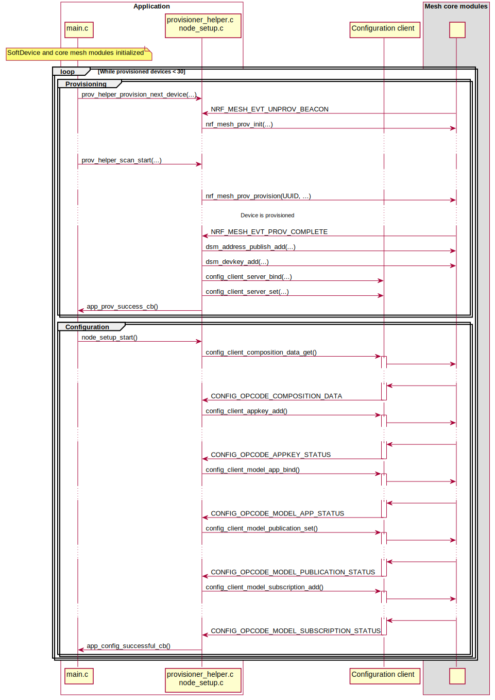

# Mesh provisioner details and Mesh APIs
@anchor light_switch_demo_provisioner

The provisoner configures a network in a fixed, predefined way. Together with [light switch server](@ref md_examples_light_switch_server_README)
and [light switch client](@ref md_examples_light_switch_client_README), it is part of
the [light switch example](@ref md_examples_light_switch_README) network demonstration.

**Table of contents**
- [Source code](@ref light_switch_provisioner_code)
- [Use of APIs](@ref light_switch_provisioner_APIs)

The provisioner is implemented as a multi-layered state machine due to the asynchronous nature of the provisioning and configuration process.
- The provisioner first provisions and configures a client device with a known URI hash.
  - The provisioner configures the client model instances on these devices to communicate with server model instances on the server boards.
- After this, it moves on to provision and configure the server devices with a known URI hash.
  - The provisioner configures the server model instance on these devices to:
    - communicate with the client model on the client board;
    - publish a message when value of the OnOff state changes.

The following diagram shows the typical state transitions of the provisioner while provisioning and configuring light switch client.

For more information on how a provisioning process works, see the [provisioning guide](@ref md_doc_getting_started_provisioning_main).

---

## Source code @anchor light_switch_provisioner_code

You can find the source code of the mesh provisioner in the following folder:
`<InstallFolder>/examples/light_switch/provisioner`

To run the mesh provisioner, see @ref md_examples_light_switch_README.

---

## Use of Mesh APIs @anchor light_switch_provisioner_APIs

The provisioner uses the following set of APIs:
- [Application support modules](@ref MESH_API_GROUP_APP_SUPPORT)
- [Management module](@ref MESH_STACK)
- [Core mesh stack](@ref MESH_API_GROUP_CORE)
- [Provisioning](@ref MESH_API_GROUP_PROV)
- [Configuration client](@ref CONFIG_CLIENT)

In general, the provisioner role is an order of magnitude more complex than the provisionee role, both in
resource requirements and in application complexity. Therefore, there is no simple "press play and it
works"-API for the provisioning and configuration process. However, for a specific use case, it can be reduced into a set of
simple steps, as implemented in the provisioner example:

1.  Initialize:
    1.  Core mesh stack.
    2.  Device state manager.
    3.  Access layer.
    4.  (Optional) Load flash configuration.
2.  Listen for unprovisioned beacons.
3.  Provision device.
4.  Configure device.
5.  If more devices should join the network, go back to step 2.

In the example code, this behavior is split between the following modules:

- `examples/light_switch/provisioner/src/main.c`: Deals with the initialization and setup of the mesh stack.
- `examples/light_switch/provisioner/src/provisioner_helper.c`: Deals with the provisioning process.
- `examples/light_switch/provisioner/src/node_setup.c`: Deals with the configuration process of the
node once the provisioning is completed.

The following figure shows the details of how provisioning and configuration are implemented with the provided APIs. Note that the
figure may simplify some API calls to provide a clearer understanding. See the relevant source
files for details.

