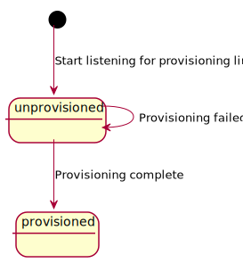
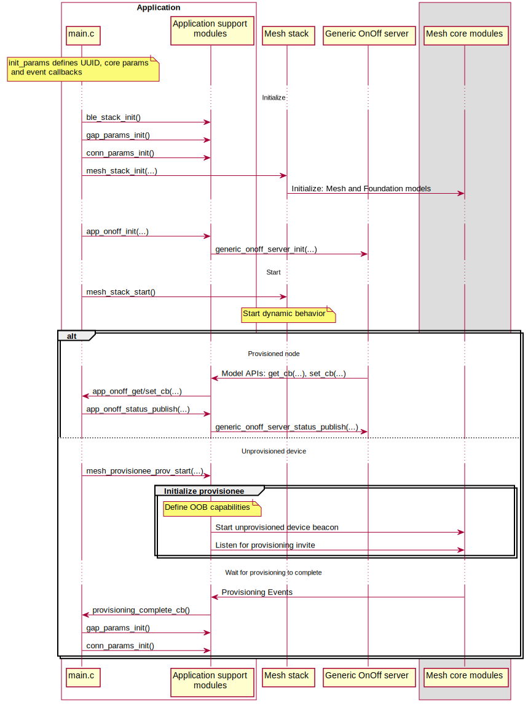

# Light switch server details and Mesh APIs
@anchor light_switch_demo_server

The light switch server is a Generic OnOff server that has a provisionee role in
the [light switch example](@ref md_examples_light_switch_README) network demonstration, which is also composed of
[light switch client](@ref md_examples_light_switch_client_README)
and [mesh provisioner](@ref md_examples_light_switch_provisioner_README). There can be one or more servers in this network,
for example light bulbs.

The light switch server instantiates one instance of the Generic OnOff server model to control the state of LED 1.

**Table of contents**
- [Source code](@ref light_switch_server_code)
- [Use of APIs](@ref light_switch_server_APIs)

The server can either be provisioned and configured:
- by the provisioner device (for example, static provisioner example);
- by a GATT-based provisioner (for example, @link_nrf_mesh_app).

The provisioner configures this server model instance to communicate with the client model.

After provisioning, the proxy server application starts sending out connectable advertisements
with Mesh Proxy Service present, which a Proxy Client can connect to in order to interact with the mesh.

The Proxy Client acts like any other mesh device, but sends all of its mesh communication
over a BLE connection to a Proxy Server, which relays it into the mesh.

---

## Source code @anchor light_switch_server_code

You can find the source code of the light switch server in the following folder:
`<InstallFolder>/examples/light_switch/server`

To run the light switch server example, see @ref md_examples_light_switch_README.

---

## Use of Mesh APIs @anchor light_switch_server_APIs

The server uses the following set of APIs:
- [Application support modules](@ref MESH_API_GROUP_APP_SUPPORT)
- [Management module](@ref MESH_STACK)
- [Core mesh stack](@ref MESH_API_GROUP_CORE)
- [Generic OnOff server model](@ref GENERIC_ONOFF_MODEL)

The management module implements the behavior of a provisionee device. It handles the
interface with the provisioning stack, setting up the configuration server, and restoring the device
state from flash.

The main application (`examples/light_switch/server/src/main.c`) implements the following functionalities:

- Setting basic configuration parameters, supported Out-Of-Band (OOB) methods, clock configuration, callbacks,
  etc.
- Adding models and their event callbacks.

When the `provisioning_complete_cb()` callback is called, the device is provisioned and ready to be
configured by the provisioner.

The following figure shows the calling sequence of key mesh stack APIs used by this example.

